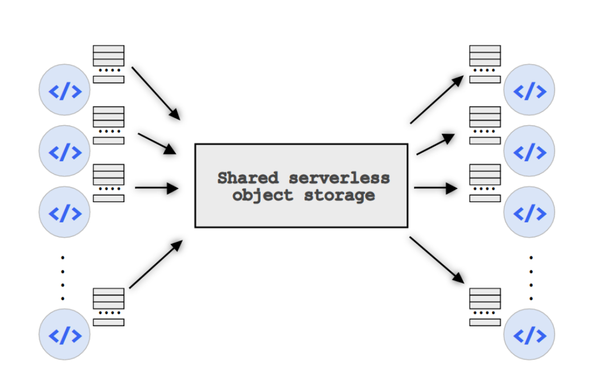

# Primula

## What is Primula
      
**Primula** is a serverless shuffle operator for general-purpose serverless frameworks. It is built upon the principles of scalability and transparency and it is designed for shuffle-like operations on routine data analysis pipelines.  

<p align="center"> </p>
      
Primula provides several features for the automatization of shuffle-like workloads, mainly:
*  Automatic inference of the optimal number of parallel workers for the shuffle operation.
*  Load-balancing of workers through data sampling.
*  Eager mitigation of straggler functions.
*  Asynchronous MapReduce execution for performance.

## Architecture
Primula is based on IBM-PyWren (now [LitHop](https://github.com/lithops-cloud/lithops)), a serverless framework for massively parallel jobs. It currently supports IBM Cloud Functions as FaaS and IBM Cloud Object Storage (COS) as remote shared storage for data persistency and communication between functions.

<p align="center">
  
</p>

## Prerequisites

* **Python > 3.4**

    Python version must be  3.4 or above.
    
* **IBM Cloud account**

    Detailed information about IBM Cloud account configuration can be found at the [IBM-PyWren github repository](https://github.com/lithops-cloud/lithops).
    1. Sign up on https://cloud.ibm.com/
    2. Copy `config.json.template` to `config.json`.
    3. Create a new IBM COS bucket and insert its public and private endpoint urls and IBM COS keys into `config.json`.
    4. Set the new bucket's name as pywren's "storage_bucket" in `config.json`.
    5. Create a new IBM Cloud Functions namespace and a CloudFoundry organization and insert your access keys into `config.json`.

* **Dataset placement**

    Datasets to be processed with Primula must be located in a IBM COS bucket.
    
## Setup and configuration

Installation of Primula in a python environment is straightforward.
1.  Clone this repository into your python environment.
2.  Move to our extended IBM-PyWren project's folder 
    ```
    cd pywren-ibm-primula
    ```
3. Install IBM-PyWren allong with Primula.
     ```
    pip install -e .
    ```
    

## Usage
Primula can be executed both from command line or from a Jupyter Notebook. We provide an example workflow at `examples/primula_example_basic.ipynb`.

## Authors
* Marc Sánchez-Artigas (Universitat Rovira i Virgili) [marc.sanchez@urv.cat](marc.sanchez@urv.cat)
* Germán T. Eizaguirre (Universitat Rovira i Virgili) [germantelmo.eizaguirre@urv.cat](germantelmo.eizaguirre@urv.cat)

## Publications
**Primula: a Practical Shuffle/Sort Operator for Serverless Computing** - ACM/IFIP Middleware 2020

## Acknowledgements


This work has been partially supported by the EUHorizon 2020 programme under grant agreement 825184 andby the Spanish Government (PID2019-106774RB-C22).
 
